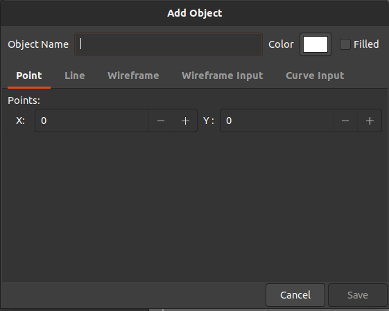

# PY-IGS - The PYthon Interactive Graphical System

<div align="center">
    </img>
    <p>
        <em>The PY-IGS</em>
    </p>
</div>

## Installation
To install this software you will need these dependencies:

- Gtk 3.20+
- Python 3.8+
- Poetry

After install them, install python dependencies
with:

```
poetry install
```

---

## How to Use
### Executing

In order to execute this program, run the following command:

```
poetry run python3 py_igs
```

### Navigation

To navigate through the world, you can use the mouse or the navigation widget.

To move with the mouse, simply click over the viewport and drag your cursor over the screen. The amplitude of this movement is inverse to the scale of the world, enabling a smooth view in your screen.

If you want to use the navigation widget, you need to click on the buttons that are displayed on the navigation grid in the left panel. You can configure the amplitude of this movement with the "Pan Step" field (world units).

For zooming, you can use your mouse scroll or the `+` and `-` buttons on the navigation grid. You can configure the zoom ammount with the "Zoom Step" slider (from 0,01% up to 50% each step)

<div align="center">
    </img>
    <p>
        <em>The navigation widget</em>
    </p>
</div>

### Adding Objects

To add an object, you need to click on the "Add" button located in the objects widget. A dialog will popup in your screen. In this dialog, insert the object name (unique in the scene) then insert the points coordinates of your object. You can select the type of the object by changing the active tab of the dialog. After that, click on the save button. The object will appear on the world at the given coordinates.

<div align="center">
    </img>
    <p>
        <em>Adding an object</em>
    </p>
</div>

### Removing Objects

Select an object of the object list and then press the remove button in the objects widget. The object will disappear.

<div align="center">
    </img>
    <p>
        <em>The objects widget</em>
    </p>
</div>

---
## About

Software developed for the Computer Graphics (INE5420-2021.1)  course. This course is part of our graduation in Computer Science at the Federal University of Santa Catarina (UFSC). 

Made by Enzo Coelho Albornoz and Gabriel Soares Flores.